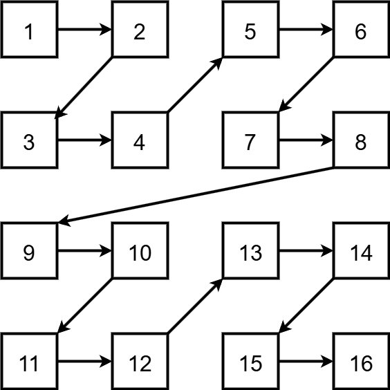

# FDU CS 2025
该部分记录了fdu-计算与智能创新学院-2025夏令营机考题目。

# Questions list
本次机考总共五道题，2.5h。笔者水平比较菜，一道都没A出来（叠甲）解答也是笔者和大神以及GPT讨论得到的结果，如果有问题，欢迎在issue中提出。😘

## ❓T1 连写分数

给定一个长度为 $n$ 且每一个字符都是 $0-9$ 的字符串 $S$，代表一个考试分数序列。字符串中的数字是连在一起的，例如"9598"，代表两次考试分别考了95和98。

大部分考试的满分为 $t$,但有 $m$ 次考试的满分比较特殊，分别为 $r_1、r_2、...、r_m$。

现在需要将字符串 $S$ 分割成若干连续子串(每个子串代表一个分数)，使得分数总和最大。

字符串解析为自然数的方法如下：对于字符串 $T=t_1,\cdots t_n$，如果 $n!=1$，$t1='0'$，则这个字符串不合法的不允许解析（即字符串不允许有前导0但单独的0是合法的）。否则， $T$ 解析为自然数 $\sum_{i=1}^{n} t_i*10^{n-i}$。

### 输入格式

第一行输入三个整数 $n, t, m$ 用空格间隔

第二行一个长度为 $n$ 的字符串

第三行 $m$ 个正整数 $r_1, r_2, \cdots r_m$ 用空格间隔。特别的，如果 $m = 0$，则第三行为一个空行

输入的数据保证至少有一种合法的分割方案

### 输出格式

输出一行一个正整数

### 样例
**输入**
```C++
4 99 0
9598
```
**输出**
```C++
193
```

**输入**
```C++
4 99 1
9598
10
```
**输出**
```C++
112
```

### 数据范围

* 对于测试点1： $1 \leq n \leq 10,  m = 0$
* 对于测试点2-3： $1 \leq n \leq 10^4, m = 0$
* 对于测试点4-5： $1 \leq n \leq 10^4$
* 对于测试点7-10： $无特殊限制$
* 对于所有测试点： $1 \leq n \leq 10^5, 0 \leq m \leq 7, 1 \leq t,r_i \leq 9999$

---
## ❓T2 滑动窗口中，独立数的中位数

给定一个长度为 **n** 的序列，以及一个长度为 **m** 的滑动窗口。
滑动窗口从左到右依次划分，能得到 **n-m+1** 个子数组。

对于每个子数组，需要计算其中 **独立数** 的 **中位数**。  

**独立数**：指在子数组中仅出现 **一次** 的元素。

- 例如：
    - 在 `[1, 2, 2]` 中，`1` 是独立数，`2` 不是独立数。
    - 在 `[1, 1, 2, 2, 3, 4]` 中，`3` 和 `4` 是独立数。

若某个滑动窗口中不存在独立数，则输出 `"No"`。

**中位数**：在非递减数组 $[a_1, a_2, \cdots, a_l]$ 中， $a_{[\frac{l+1}{2}]}$ 称为数组的中位数。


### 输入格式

* 第一行：两个整数 **n** 和 **m**
* 第二行：包含 **n** 个整数，表示序列元素


### 输出格式

* 输出 **n-m+1** 行，每行一个整数或者字符串`No`
* 若不存在独立数，则输出 `No`

### 样例
**输入**
```C++
7 3
1 2 3 3 3 4 -1
```
**输出**
```C++
2 
2 
No 
4 
3
```

### 数据范围

* 对于测试点1-2： $1 \leq n \leq 1000, 1 \leq a_i \leq 10^5$
* 对于测试点3-5： $1 \leq a_i \leq 10^5$
* 对于测试点6-10： $无特殊限制$
* 对于所有测试点： $1 \leq n \leq 5 * 10^5, 1 \leq m \leq n, -10^9 \leq a_i \leq 10^9$

---
## ❓T3 树的重心

给定一棵树，定义 $d(i)$ 为：
去除节点 $i$ 后，整棵树将被划分为若干个连通子图。此时 $d(i)$ 的值为所有连通子图中，**节点数最大的连通子图的大小**。

* 例如：在一棵二叉树中，删除某个节点可能会得到三个连通子图。
* $d(i)$ 就取其中节点数最多的那一个子图的节点数。

**树的重心**：定义为

$$
\min_i d(i)
$$

即所有节点中，使得最大连通子图尽可能小的那个（或那些）节点。


### 示例说明

考虑下图的树：

```
1  
|  
2 -- 4  
|  
3
|
5
```

* 删除节点 `2` 后，树被分成三个部分：`[1]`、`[4]`、`[3-5]`。
* 其中最大连通子图是 `[3-5]`，大小为 2。
* 因此 $d(2) = 2$。


### 输入格式

* 第一行：一个整数 **n**，表示节点总数，节点为`1,2,... n`
* 接下来 **n-1** 行：每行两个整数 $a_i, b_i$，表示节点 $a_i$ 与 $b_i$ 之间存在一条边


### 输出格式

* 第一行：输出一个整数n表示树的重心个数
* 第二行：输出n个整数，用空格分开，表示树所有的重心的编号，编号从小到大排列


### 样例

**输入**

```C++
4
1 2
2 3
2 4
```

**输出**

```C++
1
2
```

**输入**
```C++
2
1 2
```

**输出**

```C++
2
1 2
```

### 数据范围

* 对于测试点1-3： $1 \leq n \leq 100$
* 对于测试点4-10： $1 \leq n \leq 10^6$

---
## ❓T4 求指定日期是星期几

已知 **2025 年 8 月 26 日是星期二**，请你编写程序计算任意给定日期 **Y 年 M 月 D 日**是星期几。

### 说明

* 年份分为**闰年**和平年。
* 判断闰年的规则：

  * 能被 **4** 整除但不能被 **100** 整除，或者能被 **400** 整除 → 闰年（366 天）；
  * 否则 → 平年（365 天）。
* 闰年的 **2 月有 29 天**，平年的 **2 月有 28 天**。

### 输入格式

* 第一行输入一个整数 $n$，表示查询的次数。
* 接下来的 $n$ 行中，每行输入三个整数 $Y, M, D$，表示要查询的日期。

### 输出格式

* 共输出 $n$ 行。
* 第 $i$ 行输出第 $i$ 次查询的结果，结果为一个整数：

  * 星期日输出 `0`
  * 星期一输出 `1`
  * …
  * 星期六输出 `6`


### 样例
**输入**
```
3
2025 8 26
2025 8 27
2024 2 29
```

**输出**

```
2
3
4
```

### 数据范围

* 对于测试点1： $Y=2025$
* 对于测试点2-3： $1 \leq n \leq 10^3, 1 \leq Y \leq 10^5$
* 对于测试点4-10： $无特殊限制$
* 对于所有测试点： $1 \leq n \leq 10^5, 1 \leq Y \leq 10^7,保证所有输入日期均为合法公历日期$

---
## ❓T5 求瓷砖的涂抹顺序
给你一个 $2^n \times 2^n$ 的瓷砖网格，它按照下面的顺序来进行涂抹。首先它会被划分为4块 $2^{n-1}\times 2^{n-1}$ 的区域，分别位于左上角、右上角、左下角和右下角，我们需要将左上角的所有瓷砖涂抹完，再涂抹右上角-左下角-右下角。  
对于左上角区域而言，它的涂抹规则依旧是，将整个 $2^{n-1}\times 2^{n-1}$ 的区域划分为4块，再按顺序涂抹。如此递归，直到该区域大小为1，即一块瓷砖。  
请问位于 $(x,y)$ 位置处的瓷砖，它是第几块被涂抹的？我们定义最左上角的瓷砖为 $(0,0)$，最左下角的瓷砖为 $(2^n-1,0)$  

### 输入格式

* 第一行为两个整数 $n，T$ 用空格隔开，代表整个网格为 $2^n \times 2^n$和询问次数T；
* 接下来 $T$ 行，每行输入两个整数 $x_i,y_i$ 用空格隔开，代表需要查询的瓷砖的行编号和列编号。

### 输出格式

* 输出T行，每行一个整数，代表对应位置的瓷砖是第几块被涂抹的。

### 样例
**输入**
```
2 16
1 1
1 2
1 3
1 4
2 1
2 2
2 3
2 4
3 1
3 2
3 3
3 4
4 1
4 2
4 3
4 4
```

**输出**
```
1
2
5
6
3
4
7
8
9
10
13
14
11
12
15
16
```
### 数据范围

* 对于测试点1-3： $1 \leq n \leq 10$
* 对于测试点4-10： $1 \leq n \leq 25$
* 对于所有测试点： $1 \leq T \leq 10000, 0 \leq x_i,y_i < 2^n$

### 图示说明

对于输入1，其图示如下



## Acknowledgements
- 感谢 [EmberQR](https://github.com/EmberQR) 提供了 **T4 $O(1)$ 最优算法** 💖 [[相关 Issue](https://github.com/IamMI/fdu-cs-coding/issues/1)]
- 感谢 [spearhead4king](https://github.com/spearhead4king) 对 **README.md** 中题目列表的修改和润色，并增添了 **T1** 与 **T5** 的插图 💖

